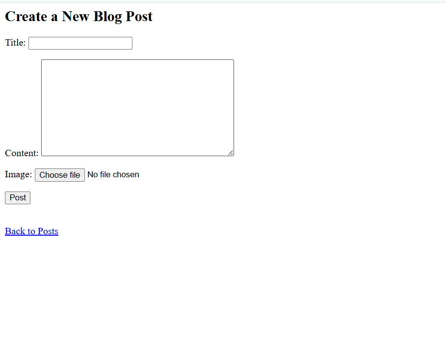
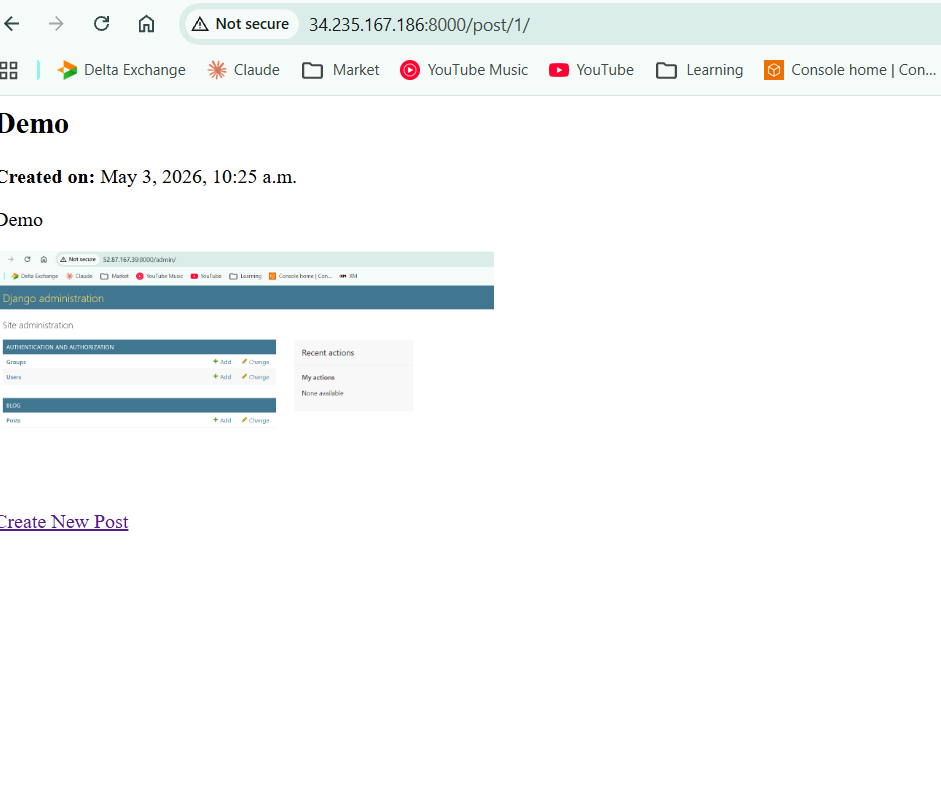
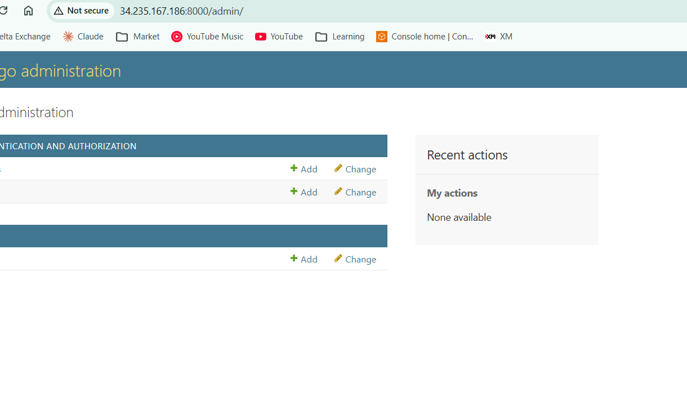
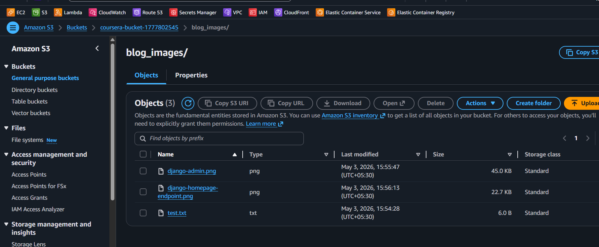
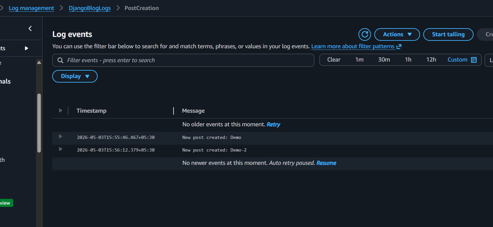

# Django Blog Project - Sprint 4

## Overview

This project is a Django Blog application enhanced for Sprint 4 with blog post creation, image upload using AWS S3, admin access, CloudWatch logging, Docker deployment, and GitHub Actions CI/CD.

## Features

- Create blog posts with title, content, and image
- View blog post details with uploaded image
- Django admin interface for managing posts
- AWS S3 integration for storing uploaded images
- AWS CloudWatch integration for logging post creation events
- MySQL/RDS database integration
- Dockerized deployment
- GitHub Actions CI/CD pipeline
- Commit history exported for submission

## Technologies Used

- Python 3.10
- Django 5.2.13
- MySQL / AWS RDS
- AWS S3
- AWS CloudWatch
- AWS EC2
- AWS ECR
- Docker
- GitHub Actions
- Gunicorn
- Pillow
- django-storages
- boto3

## Setup Instructions

### 1. Clone the repository
    cd ~/Sprint-4
    git clone <repository-url>
    cd Sprint-3

### 2. Create and activate virtual environment

    python3 -m venv env
    source env/bin/activate

### 3. Install dependencies

    pip install -r requirements.txt

### 4. Configure environment variables

The following environment variables are required:

    DB_NAME=blog_db
    DB_USER=coursera
    DB_PASSWORD=coursera
    DB_HOST=coursera-mysql-instance.ci72ci0ewyvm.us-east-1.rds.amazonaws.com
    AWS_ACCESS_KEY_ID=<your-access-key>
    AWS_SECRET_ACCESS_KEY=<your-secret-key>
    AWS_STORAGE_BUCKET_NAME=coursera-bucket-1777802545
    AWS_S3_REGION_NAME=us-east-1

### 5. Apply migrations

    cd blog_project
    python3 manage.py makemigrations
    python3 manage.py migrate

### 6. Create admin user

    python3 manage.py createsuperuser

### 7. Run application

    python3 manage.py runserver 0.0.0.0:8000

Application URLs:

    Blog Home: http://<EC2_PUBLIC_IP>:8000/
    Create Post: http://<EC2_PUBLIC_IP>:8000/post/new/
    Admin: http://<EC2_PUBLIC_IP>:8000/admin/

## Sprint 4 Steps Completed

### Blog Post Model Updated

The Post model was updated to support blog title, content, creation date, image upload, and author.

### Blog Form Added

A PostForm was created in blog/forms.py to allow users to create blog posts with images.

### Templates Added

The following templates were added:

    blog/templates/blog/create_post.html
    blog/templates/blog/post_detail.html

### URLs Added

The following routes were added:

    /
    /post/new/
    /post/<id>/

### AWS S3 Integration

S3 was configured using django-storages and boto3.

Uploaded images are stored in:

    s3://coursera-bucket-1777802545/blog_images/

### AWS CloudWatch Monitoring

CloudWatch logging was added using boto3.

Log group:

    DjangoBlogLogs

Log stream:

    PostCreation

A log entry is created whenever a new blog post is submitted.

### Django Admin Access

The Post model was registered in Django admin with list display, filters, and search fields.

### Docker Deployment

The project is containerized using Docker and deployed on EC2.

Docker image is pushed to AWS ECR through GitHub Actions.

### GitHub Actions CI/CD

GitHub Actions workflow performs:

- Dependency installation
- Django checks
- Django tests
- Docker image build
- Push to AWS ECR
- Deployment to EC2

Required GitHub repository secrets:

    AWS_ACCESS_KEY_ID
    AWS_SECRET_ACCESS_KEY
    AWS_STORAGE_BUCKET_NAME
    EC2_SSH_PRIVATE_KEY

## Useful Commands

Run Django server:

    python3 manage.py runserver 0.0.0.0:8000

Check uploaded S3 images:

    aws s3 ls s3://coursera-bucket-1777802545/blog_images/

Check CloudWatch logs:

    aws logs get-log-events --log-group-name DjangoBlogLogs --log-stream-name PostCreation

View commit history:

    git log --oneline --graph --all

Generate commit log file:

    git log --oneline --graph --all > commits.txt

Check Docker container:

    sudo docker ps

Check Docker logs:

    sudo docker logs blog_web

## Issues Encountered and Fixes

### Missing forms.py

Error:

    ModuleNotFoundError: No module named 'blog.forms'

Fix:

Created blog/forms.py and added PostForm.

### Missing URL Route

Error:

    Page not found: /post/new/

Fix:

Added post/new/ and post/<int:pk>/ routes in blog/urls.py.

### Missing Template

Error:

    TemplateDoesNotExist: blog/create_post.html

Fix:

Created blog/templates/blog/create_post.html.

### S3 Forbidden Error

Error:

    An error occurred (403) when calling the HeadObject operation: Forbidden

Fix:

Updated the correct S3 bucket environment variable:

    AWS_STORAGE_BUCKET_NAME=coursera-bucket-1777802545

### GitHub Push Protection Error

Error:

    Push cannot contain secrets

Fix:

Removed .env from Git tracking and added .env to .gitignore.

### Docker Gunicorn Error

Error:

    exec: "gunicorn": executable file not found in $PATH

Fix:

Added gunicorn to requirements.txt.

## Security Notes

- .env is not committed to GitHub
- AWS credentials are stored in GitHub Actions secrets
- EC2 SSH private key is stored in GitHub Actions secrets
- Database and AWS credentials are passed through environment variables
- S3 bucket is used for uploaded blog images

## Screenshots

### Blog Post Form

### Blog Post Detail Page

### Admin Interface

### S3 Bucket Uploaded Image

### CloudWatch Logs

### Commit History

[View commits.txt](images/commits.txt)

## Final Checklist

- Blog post form implemented
- Blog post detail page implemented
- Image upload working with AWS S3
- Uploaded image visible from S3
- Admin interface configured
- CloudWatch logs created after post creation
- Docker deployment completed
- GitHub Actions CI/CD configured
- Screenshots added in images/
- Commit log added as images/commits.txt
